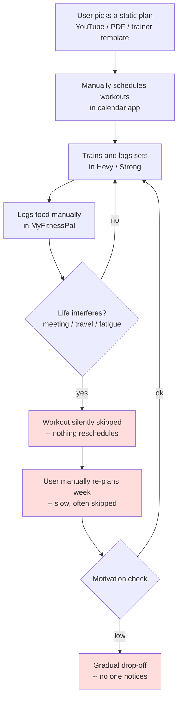
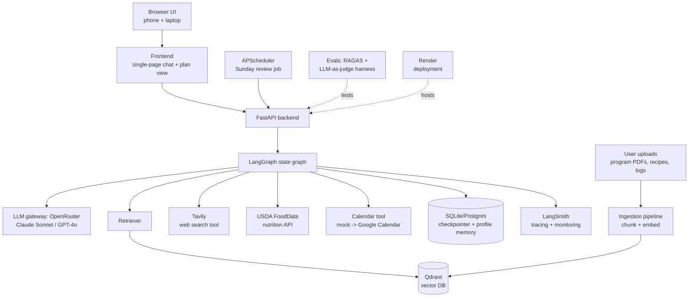
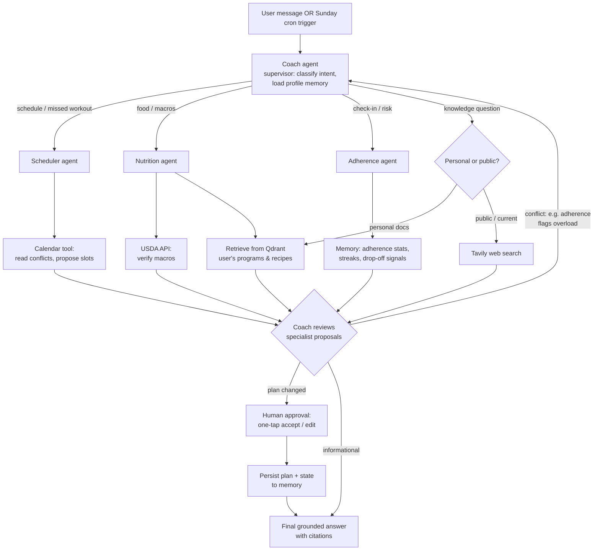

# SteadyFit — Capstone Plan & Architecture

An agentic AI fitness copilot for everyday people, built as a multi-agent LangGraph system
with Agentic RAG over the user's own fitness data.

---

## Task 1: Defining Problem, Audience, and Scope

### Problem (one sentence, no solution implied)

Busy working adults who want to get fit consistently fall off their workout and nutrition
plans within weeks because everyday life — meetings, travel, fatigue, and social meals —
keeps breaking plans that never adapt.

### Why this is a problem (who, what, today, why it fails)

The user is a **busy working professional (25–45)** — think a software engineer, analyst, or
manager — who has joined a gym, wants to lose fat or build muscle, and can realistically
train 3–4 times a week. Their "job function" being automated here is the unpaid second job
of **self-coaching**: planning workouts, planning meals, tracking food, and re-planning every
time life interferes.

Today they cobble together a static plan from a YouTube program or a PDF, a workout logger
(Hevy/Strong), a calorie tracker (MyFitnessPal), and a calendar. None of these talk to each
other, and none of them act on their own. When Tuesday's workout is killed by a late meeting,
nothing reschedules it. When they eat out three times in a week, nothing rebalances the
remaining days. When they silently skip two weeks, nothing notices, simplifies the plan, or
checks in. The tools are passive trackers; all of the adaptive decision-making — the part
people are worst at when tired and demotivated — is left to the user. The predictable result
is the industry's well-known drop-off curve: most gym-goers quit within a few months, not
because their plan was wrong, but because nothing helped the plan survive contact with
real life.

### Current-state workflow diagram

Pain points (red): the re-planning step is manual and usually skipped; missed sessions are
invisible; drop-off is only discovered after it has already happened.

### Evaluation questions / input–output pairs (seed set)

| # | Input (user message / event) | Expected output behavior |
|---|---|---|
| 1 | "I missed Monday's leg day and I'm traveling Wed–Fri with only a hotel gym." | Redistributed week: leg session moved, hotel-gym-friendly substitutions (dumbbell/machine), no guilt language. |
| 2 | "I had biryani and a mango lassi at a work lunch." | Reasonable calorie/macro estimate logged; remaining-day guidance adjusted; no shaming. |
| 3 | "What does my own program say I should do for a deload week?" | Answer grounded in the **user's uploaded program PDF** (RAG citation), not generic advice. |
| 4 | "Is creatine safe to take daily?" | Web-search-grounded answer (Tavily) with sources; safe, evidence-based framing. |
| 5 | Sunday review trigger (no user input) | Autonomous weekly summary: adherence %, weight trend, next week's plan proposal, one-tap approval request. |
| 6 | User has skipped 3 sessions in 10 days | Adherence agent flags risk; plan is **simplified** (fewer/shorter sessions), supportive check-in sent. |
| 7 | "Give me a high-protein dinner from my recipes under 600 kcal." | Recipe retrieved from user's uploaded recipe collection (RAG), macros verified via food API. |
| 8 | "Should I bulk or cut?" | Asks for/uses profile data (weight trend, goal, body-fat estimate); reasoned recommendation, not generic. |

---

## Task 2: Propose a Solution

### Solution (one sentence)

SteadyFit is a proactive multi-agent fitness copilot — a LangGraph "coaching council" of
Coach, Scheduler, Nutrition, and Adherence agents — that grounds its advice in the user's own
uploaded fitness documents (Agentic RAG) and live web search, and autonomously re-plans the
user's training and nutrition week around their real life.

### Infrastructure diagram

### Component choices (one sentence each)

| Component | Choice | Why |
|---|---|---|
| LLM(s) | Claude Sonnet (primary) + GPT-4o-mini (cheap judge) via **OpenRouter** | Strong tool-calling and reasoning for agent negotiation; OpenRouter satisfies the LLM-gateway requirement and lets me swap models with one env var. |
| Agent orchestration | **LangGraph** (supervisor pattern) | Graph-with-conditional-edges is the natural fit for a supervisor routing to specialists and looping on disagreement, and it's the framework from my cohort. |
| Tools | **Tavily** (public search), **USDA FoodData Central** (nutrition facts), **Calendar tool** (mock JSON now, Google Calendar API as stretch) | Tavily covers the "public data" requirement; USDA grounds macro math in real data; the calendar tool powers life-aware re-planning. |
| Embedding model | **OpenAI text-embedding-3-small** | Cheap, fast, strong on short semi-structured chunks like exercises and recipes. |
| Vector database | **Qdrant** (local Docker in dev, Qdrant Cloud free tier in prod) | Production-grade, has hybrid (dense+sparse) search built in — which I use for the Task 6 advanced-retrieval upgrade. |
| Memory | **LangGraph SQLite/Postgres checkpointer** (conversation/graph state) + a `user_profile` table (goals, injuries, preferences, weight log) | Satisfies the memory requirement with both short-term (thread) and long-term (profile) memory. |
| Monitoring | **LangSmith** | One env var gives full traces of every agent hop and tool call — essential for debugging multi-agent loops. |
| Evaluation | **RAGAS** (faithfulness, context precision/recall) + custom **LLM-as-judge** rubric for coaching quality | RAGAS covers the RAG half; the judge rubric covers agent behavior (tone, safety, plan sanity). |
| User interface | Single-page chat + weekly-plan view (vanilla HTML/JS served by FastAPI) | One deployable unit that runs in any phone or laptop browser (requirement) with zero build step. |
| Deployment | **Render** (one web service) | Free tier, native Python, persistent disk for SQLite, public HTTPS endpoint (requirement). |

### Agent workflow diagram (end to end)

**How it works:** Every turn — whether a user message or the autonomous Sunday trigger —
enters at the Coach agent, which loads the user's profile memory and classifies intent.
Knowledge questions route through Agentic RAG: the Coach decides whether the answer lives in
the user's **own documents** (retrieve from Qdrant) or on the **public web** (Tavily), and can
use both. Action requests route to specialists: the Scheduler reads the calendar tool and
proposes a re-planned week; the Nutrition agent adjusts macros and verifies them against the
USDA API; the Adherence agent inspects streak/skip data from memory.

The Coach then reviews specialist proposals in a "council" step. This is where the agentic
behavior shows: if the Adherence agent flags drop-off risk while the Scheduler proposes a
dense week, a conditional edge loops back to the Coach, which resolves the conflict by
simplifying the plan. Any plan **change** goes through a human-in-the-loop approval
(LangGraph `interrupt`) before being persisted; informational answers return directly with
citations. All state is checkpointed so the Sunday review continues exactly where the user's
history left off.

**Requirements coverage:** LLM gateway → OpenRouter; memory → checkpointer + profile store;
runs in a browser on phone and laptop → responsive single-page UI on a public Render URL.

---

## Task 3: Dealing with the Data

### Chunking strategy

**Markdown/structure-aware recursive splitting, ~750 tokens per chunk with 100-token
overlap** (LangChain `RecursiveCharacterTextSplitter`, with a Markdown-header splitter first
pass for structured docs, and per-recipe / per-workout-day splitting where the document
structure makes those units detectable).

Why: fitness documents are highly **unit-structured** — a training program is a list of
weeks/days, a recipe book is a list of recipes. A retrieval hit is only useful if it contains
the *whole* unit (a complete workout day with sets and reps; a full recipe with ingredients
and macros), so I split on structural boundaries first and only fall back to recursive
character splitting for prose. 750 tokens comfortably holds a full workout day or recipe;
100-token overlap protects against units that straddle boundaries.

### Data sources and external API

- **Personal data (RAG):** the user's uploaded fitness documents — their training program
  (PDF/Markdown), a personal recipe collection, and exported workout/weight logs (CSV). These
  are chunked, embedded, and stored per-user in Qdrant.
- **External API #1 — Tavily (agentic search):** answers public/current questions (supplement
  safety, exercise science, "is the gym near my hotel open Sunday") that personal docs can't.
- **External API #2 — USDA FoodData Central:** authoritative macro/calorie data so the
  Nutrition agent's math is grounded rather than hallucinated.

**How they interact:** the Coach agent treats retrieval as a decision, not a default
(Agentic RAG). "What does *my* program say about deload week?" → Qdrant only. "Is creatine
safe?" → Tavily only. "Plan a high-protein dinner from my recipes" → Qdrant retrieves the
recipe, then USDA verifies its macros, and if the recipe collection has no match, the agent
falls back to Tavily and says so. Retrieved chunks and search results are injected into the
specialist prompts with source tags, and every grounded answer cites its source.

---

## Task 4: End-to-End Prototype (build plan)

1. Core graph: Coach supervisor + Nutrition agent + shared Pydantic state + SQLite
   checkpointer, tested from CLI.
2. Agentic RAG: upload endpoint → ingestion pipeline → Qdrant; retrieval tool wired to the
   graph; Tavily tool wired to the graph.
3. Remaining agents (Scheduler, Adherence) + council conditional edges + `interrupt`
   approval step.
4. APScheduler Sunday-review job (the autonomous loop).
5. Frontend chat + plan view; deploy to Render (public endpoint requirement).

## Task 5: Evals (plan)

- **Test set:** ~50 examples — the 8 seed cases above expanded with synthetic variations
  generated from my own uploaded docs (so RAG questions have known gold contexts), plus
  10 adversarial cases (injury mentions, crash-diet requests → must respond safely).
- **Harness:** RAGAS (faithfulness, answer relevancy, context precision/recall) for the RAG
  path; LLM-as-judge rubric (0–5 on groundedness, plan sanity, tone, safety) for agent
  behavior; simple assertion checks for structured outputs (plan JSON validity).
- **Baseline conclusion format:** metric table before/after, per-category breakdown.

## Task 6: Improving the Prototype (plan)

- **Advanced retrieval:** switch Qdrant to **hybrid search (dense + BM25 sparse) with
  reciprocal-rank fusion**, because fitness queries are keyword-heavy ("RDL", "deload",
  "5x5") and exact-term sparse matching should raise context precision on program docs.
- **Second improvement:** upgrade the council step from single-pass to a
  critique-and-revise loop (Coach critiques specialist plan once before approval), measured
  by the LLM-judge plan-sanity score.
- Report both against the Task 5 baseline in a table.

## Task 7: Next Steps

**Keep for Demo Day:** the multi-agent council with visible deliberation transcript (the
differentiator), Agentic RAG routing between personal docs and Tavily, the autonomous Sunday
review, and the eval harness with before/after numbers.

**Change/improve:** replace the mock calendar with real Google Calendar OAuth; add photo
meal logging (vision); move SQLite → Postgres for multi-user; add streaming responses in the
UI. Rationale: these raise polish and realism but none of them are needed to prove the core
agentic thesis, so they're sequenced after the evaluated core is solid.

## Final submission checklist

- [ ] Public GitHub repo (this scaffold)
- [ ] ≤10-min Loom demo (script: missed-workout re-plan → personal-doc RAG question →
      Tavily question → trigger Sunday review → show LangSmith trace → show eval table)
- [ ] This document, updated with actual eval results
- [ ] All code
