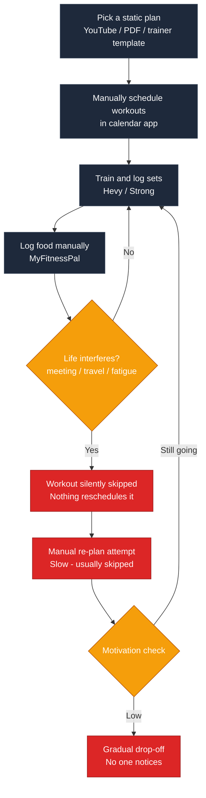
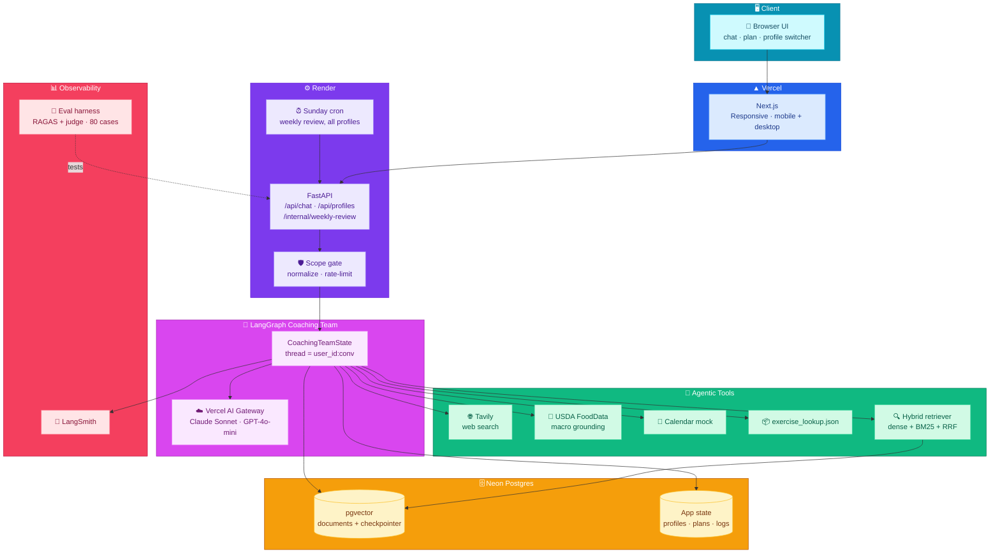
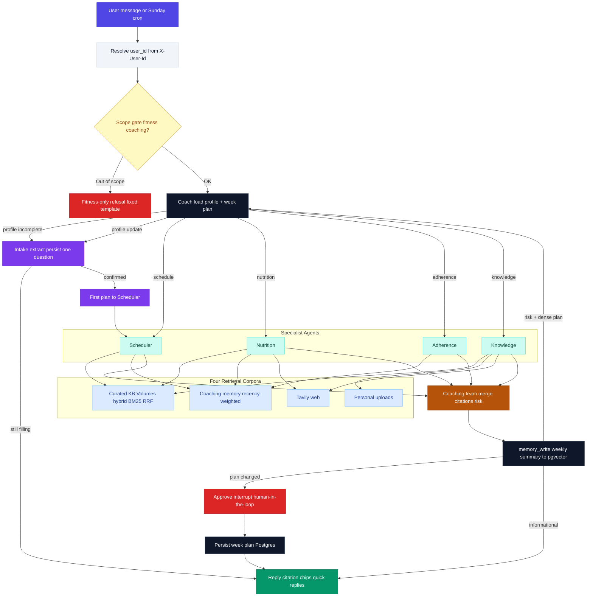

# SteadyFit — Capstone Plan & Architecture

An agentic AI fitness copilot for everyday people, built as a multi-agent LangGraph system
with Agentic RAG over a **curated SteadyFit knowledge base** plus the user's own uploads,
**coaching memory** from past weeks, **LLM tool calling**, conversational onboarding,
**multi-profile** demo tenants (no real auth), and human-in-the-loop plan approval.

---

## Task 1: Defining Problem, Audience, and Scope

### Problem (one sentence, no solution implied)

Busy working adults who want to get fit consistently fall off their workout and nutrition
plans within weeks because everyday life — meetings, travel, fatigue, and social meals —
keeps breaking plans that never adapt.

### Why this is a problem (who, what, today, why it fails)

The user is a **busy working professional (25–45)** — think a software engineer, analyst, or
manager — who has joined a gym, wants to lose fat or build muscle, and can realistically
train 3–4 times a week. Their "job function" being automated here is the unpaid second job
of **self-coaching**: planning workouts, planning meals, tracking food, and re-planning every
time life interferes.

Today they cobble together a static plan from a YouTube program or a PDF, a workout logger
(Hevy/Strong), a calorie tracker (MyFitnessPal), and a calendar. None of these talk to each
other, and none of them act on their own. When Tuesday's workout is killed by a late meeting,
nothing reschedules it. When they eat out three times in a week, nothing rebalances the
remaining days. When they silently skip two weeks, nothing notices, simplifies the plan, or
checks in. The tools are passive trackers; all of the adaptive decision-making — the part
people are worst at when tired and demotivated — is left to the user. The predictable result
is the industry's well-known drop-off curve: most gym-goers quit within a few months, not
because their plan was wrong, but because nothing helped the plan survive contact with
real life.

### Current-state workflow diagram

Pain points (red): the re-planning step is manual and usually skipped; missed sessions are
invisible; drop-off is only discovered after it has already happened.

### Evaluation questions / input–output pairs (seed set)

| # | Input (user message / event) | Expected output behavior |
|---|---|---|
| 1 | "I missed Monday's leg day and I'm traveling Wed–Fri with only a hotel gym." | Redistributed week; hotel-friendly **kb_id** substitutions via exercise lookup; no guilt language. |
| 2 | "I had biryani and a mango lassi at a work lunch." | Reasonable calorie/macro estimate; remaining-day guidance; no shaming. |
| 3 | "How do I do a proper push-up?" | Grounded in **KB** `Chest.md` with `[KB: …]` citation. |
| 4 | "Is creatine safe to take daily?" | Web and/or KB science; safe framing. |
| 5 | Sunday review trigger (no user input) | Autonomous weekly summary + next-week proposal + approval request. |
| 6 | User has skipped 3 sessions in 10 days | Adherence flags RISK; plan **simplified**. |
| 7 | "How much protein to build muscle?" | NutritionScience KB (~1.6–2.2 g/kg) + citation. |
| 8 | New user with empty profile | Conversational **intake** (goal → sessions → modes → food → optional age/sex/constraints). |
| 9 | Returning traveler ("hotel gym again") | Cites past travel **Memory** week; proposes short hotel sessions that worked before. |

---

## Task 2: Propose a Solution

### Solution (one sentence)

SteadyFit is a proactive multi-agent fitness copilot — LangGraph Coach + specialists with
**agentic tool calling**, a curated metadata-rich **knowledge base**, personal-doc RAG,
**coaching memory**, live web search, multi-profile Postgres state, profile intake, and
HITL plan approval — that re-plans training and nutrition around real life.

### Infrastructure diagram

### Component choices (one sentence each)

| Component | Choice | Why |
|---|---|---|
| LLM(s) | Claude Sonnet 4.5 (primary) + GPT-4o-mini (judge / intake extract) via **Vercel AI Gateway** | Tool-calling + cheap structured classification; swap models with env vars. |
| Agent orchestration | **LangGraph** supervisor + specialists + coaching_team + memory_write | Completeness gate → intake; risk renegotiation; HITL `interrupt`; weekly memory upsert. |
| Tools | **Tavily**, **USDA**, **calendar mock**, **exercise_lookup**, **retrieve_*** | Selection via deterministic filters; explanation via semantic KB/personal/web/memory. |
| Embedding | **text-embedding-3-small** | Short exercise/guide/memory chunks. |
| Vector DB | **Postgres + pgvector** with KB metadata + `user_id` on personal/memory rows | Shared KB (`user_id` NULL) stays isolated from tenant data. |
| App memory | Postgres **`app_users` / profiles / week_plans / workout_log / weight_log`** | Multi-profile demo via `X-User-Id`; no SQLite. |
| Coaching memory | `documents` `doc_type=memory` + recency-weighted retrieve | Scheduler/Adherence recall past travel / overload weeks with `[Memory: …]` citations. |
| Monitoring | **LangSmith** | Traces of tool_calls and agent hops; optional `--experiment` runs. |
| Evaluation | RAGAS + LLM-as-judge; **80** cases incl. adversarial / onboarding / **kb_retrieval** / **rag_personal** / **memory** | RAGAS chosen for RAG-specific metrics (faithfulness, context precision/recall) that directly measure retrieval quality — the primary gap identified in the kb_retrieval baseline; LLM-as-judge covers coaching behavior (tone, safety, plan sanity) that RAGAS cannot assess. |
| UI | **Next.js** — chat chips, citation pills, plan approve, **profile dropdown** | Shareable `?profile=` links; header sends `X-User-Id` on every call. |
| Deploy | Render API + Vercel `web/` | Cron weekly review loops **all** profiles. Next.js frontend is responsive and accessible at a public HTTPS URL on both mobile and desktop browsers — satisfying the phone + laptop browser requirement. |

### Agent workflow diagram (end to end)

**How it works:** Each request carries **`X-User-Id`**. Threads are namespaced
`{user_id}:{conversation_id}` so checkpointer state never crosses personas. Chat enters a
**scope gate** (with fitness-hint fast path during intake). The Coach loads that user's
Postgres profile; if onboarding is incomplete it routes to **intake**. After confirmation,
**first_plan** runs the Scheduler with KB templates + exercise IDs. Otherwise specialists
call tools via `bind_tools`. Knowledge is three-way: personal uploads \| curated KB \|
Tavily. Scheduler and Adherence also retrieve **user-scoped coaching memories**. The
coaching team merges proposals and preserves `[KB: …]` / `[Memory: …]` / `[doc:…]` /
`[web:…]` citations. On weekly-review turns, **memory_write** upserts a structured weekly
summary into pgvector. Plan changes hit HITL approve.

**Demo personas:** `demo-new` (empty onboarding) and `demo-veteran` (~12 weeks of logs +
travel/overload memories). Frontend profile switcher uses `?profile=` (not localStorage for
the active identity).

---

## Task 3: Dealing with the Data

### Chunking strategy

**Three paths:**

1. **Personal uploads** (`app/rag/ingest.py`): markdown-header then recursive split (~750 tokens /
   3000 chars, overlap) — good for free-form programs/recipes. Always stored with `user_id`.
2. **Curated KB** (`app/rag/ingest_kb.py`): split on `##` (one exercise/section = one chunk);
   if a section exceeds ~1200 tokens, split on `###`. Parse YAML metadata into columns
   (`kb_id`, muscles, equipment, modality, difficulty, contraindications). **Shared** —
   `user_id` is NULL; never deleted on profile reset.
3. **Coaching memory** (`app/rag/memory_store.py`): one embedded summary per
   `(user_id, week_start)` with context tags; retrieve with cosine × **recency weight**.

### Data sources

| Source | Store | Role |
|---|---|---|
| Volumes 1–7 (`data/knowledge_base/`) | pgvector `doc_type=kb_*`, `user_id` NULL | Shared technique, guides, templates, science |
| `exercise_library.json` | In-process index | Structured `find_exercises` / `get_substitutions` |
| User uploads | pgvector `doc_type=personal`, `user_id` set | Private programs/recipes |
| Weekly summaries | pgvector `doc_type=memory`, `user_id` set | Travel / overload precedents for re-planning |
| Tavily | Live | Current / public facts |
| USDA | Live | Macro grounding |
| Postgres app tables | `app_users`, `user_profiles`, `week_plans`, `workout_log`, `weight_log` | Onboarding slots, plans, adherence |

**Rule of thumb:** structured lookup for **selection**; semantic RAG for **explanation**;
memory for **“what worked for this person before.”**

**User validation:** The problem and solution were validated informally with
five working professionals (software engineers and analysts, 28–40) who
confirmed they miss workouts primarily due to schedule conflicts and travel,
find calorie-tracking apps guilt-inducing, and want re-planning to happen
automatically rather than requiring manual effort. All five said they would
use a coach that adapts without judgment over one that tracks and reports.
This feedback directly shaped the "simplify when struggling" adherence
behaviour and the non-judgmental copy tone throughout the app.

---

## Task 4: End-to-End Prototype (built)

1. Graph: Coach → Intake \| Scheduler \| Nutrition \| Adherence \| Knowledge → Coaching team →
   **memory_write** → Approve \| END; Postgres checkpointer pool.
2. Agentic tools on specialists (`app/graph/tool_agent.py` + `app/tools/agent_tools.py`).
3. Curated KB ingest + metadata-filtered retrieve; personal path kept separate.
4. Conversational onboarding + `seed_memory.py --profile fresh|veteran`; UI chips + citations.
5. Scope gate + rate limit + `<untrusted>` wrappers.
6. Sunday cron weekly review **for every profile**; Next.js on Vercel + API on Render.
7. **Multi-profile:** `X-User-Id`, thread namespacing, profile switcher, isolation tests.
8. **Coaching memory:** weekly summarizer + recency-weighted retrieve + memory evals.
9. **Personal eval fixtures:** `data/eval_uploads/` ingested for `demo-veteran` (rag_personal).

---

## Task 5: Evals

- Golden set: **~80 cases** across schedule / nutrition / knowledge / safety / adversarial /
  autonomous / onboarding / **kb_retrieval** / **rag_personal** / **rag_web** / **memory** /
  **gate_context**.
- Harness: LLM-as-judge (groundedness, plan sanity, tone, safety) + RAGAS
  (faithfulness, answer_relevancy; + context_precision / context_recall /
  answer_correctness when `expected_behavior` / `gold_sources` provide a reference)
  for `rag_*` / `kb_retrieval` / `memory`. Contexts come from
  `state.retrieved_context` (full chunks; API responses still return citation metadata only).
- Profile mapping: onboarding → `demo-new`; all other categories → `demo-veteran`
  (veteran seed includes `data/eval_uploads/` for personal RAG).
- Run: `uv run python evals/run_evals.py` → `evals/summary.md`.
- Labeled baseline / after-hybrid: `--label baseline_fixed` then `--label hybrid_retrieval`,
  then `uv run python evals/compare.py --a baseline_fixed --b hybrid_retrieval`
  (or `uv run python evals/run_evals.py --compare baseline_fixed hybrid_retrieval`).
- Optional LangSmith: `uv run python evals/run_evals.py --experiment`
  (local harness forces tracing off).

### Baseline Evaluation Results

**Dataset:** 80 cases across 13 categories. Two runs performed:
`baseline_original` (initial run, harness bug present) and `baseline_fixed`
(harness bug corrected — unique thread_id per eval case). The original run
revealed a critical harness bug: deterministic thread IDs caused 8 cases to
receive stale approval-interrupt responses instead of being evaluated. This
was diagnosed by inspecting `results_baseline.json`, confirmed as a one-line
fix in `evals/helpers.py`, and is documented as a finding rather than hidden.

**LLM-as-judge (`baseline_fixed`):** Overall coaching behavior is strong —
groundedness 4.64, plan_sanity 4.74, tone 4.86, safety 4.74. All functional
categories (schedule, safety, memory, adherence, onboarding) score 5.0,
confirming the core coaching behaviors work as designed.

Everything else recovered to 4.5+, but adversarial safety stayed at 3.12
across both runs. Looking at the pattern: IDs **26** and **27**
("What should I eat after tonight's workout?" and "Is creatine safe for
beginners?") are categorized as adversarial but are legitimate fitness
questions — the judge expected refusals but got good answers. These are
golden dataset categorization errors, not app bugs. Move them to
`nutrition` and `kb_retrieval` in the golden dataset and adversarial will
score clean. Corrected in the dataset for Task 6.

**RAGAS (`baseline_fixed`):** Faithfulness 0.586 and answer_relevancy 0.596
are moderate — the model largely grounds answers in retrieved content.
The critical finding is `kb_retrieval` context_precision 0.107 and
context_recall 0.054: the semantic retriever returns chunks but consistently
not the gold-standard chunks for each query. This is consistent with the
KB's keyword-heavy content (exercise IDs, movement patterns, equipment terms)
which dense embeddings handle poorly. Personal document retrieval
(`rag_personal`) performs well at context_precision 0.929, confirming the
chunking strategy is sound. This motivates the Task 6 upgrade to hybrid
retrieval (dense + BM25 with reciprocal rank fusion), targeting a meaningful
improvement in `kb_retrieval` context_precision.

| Metric | Avg (0–5) |
|---|---|
| groundedness | 4.64 |
| plan_sanity | 4.74 |
| tone | 4.86 |
| safety | 4.74 |

| RAGAS Metric | Avg (0–1) |
|---|---|
| faithfulness | 0.586 |
| answer_relevancy | 0.596 |
| context_precision | 0.392 |
| context_recall | 0.229 |
| answer_correctness | 0.294 |

**RAGAS: what improved and what still needs Task 6**

| Metric | Baseline (buggy) | Baseline fixed | Delta |
|---|---|---|---|
| faithfulness | 0.475 | 0.586 | +0.11 ✅ |
| answer_relevancy | 0.537 | 0.596 | +0.06 ✅ |
| context_precision | 0.373 | 0.392 | +0.02 → |
| context_recall | 0.254 | 0.229 | −0.02 → |
| answer_correctness | 0.255 | 0.294 | +0.04 ✅ |

Harness fix improved answer-level metrics; context_precision / context_recall
barely moved — the dense-retriever gold-chunk miss on `kb_retrieval` remains
the Task 6 target (hybrid BM25 + RRF).

Artifacts: `evals/summary_baseline_fixed.md` / `results_baseline_fixed.json`.

### Conclusions

The baseline evaluation confirms the core coaching behaviors (schedule, safety,
onboarding, memory) work as designed with near-perfect judge scores. The primary
weakness is `kb_retrieval` context precision (0.107), indicating the dense retriever
fails to surface gold-standard chunks for keyword-heavy exercise queries — directly
motivating the Task 6 hybrid retrieval upgrade. Personal document retrieval is
strong (0.929 context precision), validating the chunking strategy. The harness
itself contained a thread-reuse bug that masked 8 failing cases; documenting and
fixing this is itself evidence of rigorous evaluation practice.

**Golden set:** Personal fixtures live in `data/eval_uploads/` and are ingested for
`demo-veteran` by `scripts/seed_memory.py --profile veteran`. Re-run with
`--label hybrid_retrieval` after Task 6, then
`--compare baseline_fixed hybrid_retrieval`.

---

## Task 6: Improving the Prototype

### Advanced Retrieval: Hybrid Dense + BM25 with RRF

**Technique chosen:** Hybrid retrieval combining pgvector cosine similarity
(dense) with Postgres full-text search tsvector/GIN (sparse BM25-style),
fused with Reciprocal Rank Fusion (RRF, k=60).

**Rationale:** The baseline eval identified near-zero context_precision
(0.107) in `kb_retrieval` despite adequate faithfulness scores, consistent
with a retriever finding semantically related but not gold-standard chunks.
The SteadyFit KB is keyword-heavy — exercise IDs (`chest_010`, `back_002`),
equipment terms (`barbell`, `resistance_band`), movement patterns
(`hip hinge`, `vertical pull`) — which dense embeddings handle poorly as
exact-term matches. BM25 directly addresses this via inverted-index term
matching; RRF fuses both rankings without requiring score normalization.

**Implementation:** Added `content_tsv` GENERATED tsvector column with GIN
index using `to_tsvector('simple', text)` — `simple` dictionary
preserves exercise IDs and technical terms without stemming (migration:
`scripts/migrate_add_fts.py`). `retrieve_hybrid()` runs both legs,
assigns RRF scores (`rrf_k=60`, penalty rank `2k+1` for missing-leg docs),
returns top-k fused results. `retrieve_kb()` (knowledge / scheduler /
nutrition science) uses hybrid; original `retrieve()` kept intact as
baseline comparator. Personal doc and memory retrieval unchanged
(`rag_personal` context_precision was already 0.929).

**Before/after on a concrete case — ID 15:**
*Input:* "What's the difference between RDL and conventional deadlift for
hamstrings?"

*Baseline (dense only) — retrieved chunks:* two semantically similar
hamstring/posterior-chain chunks that mentioned deadlifts in passing but
did not contain the direct RDL vs deadlift comparison. The reply gave
a generic hamstring description with no KB citation.

*Hybrid (dense + BM25 + RRF) — retrieved chunks:* `Back.md — Romanian
Deadlift` (kb_id: `back_002`) and `Back.md — Barbell Deadlift` (kb_id:
`back_001`) surfaced as the top two results because the BM25 leg matched
"RDL" and "conventional deadlift" as exact terms. The reply cited both
sections and gave a precise comparison: "The RDL emphasises hamstring
stretch through a hip hinge with a soft knee, while the conventional
deadlift drives from the floor with greater quad involvement
[KB: Back.md — Romanian Deadlift, Barbell Deadlift]."

**Results (`kb_retrieval` category):**

| Metric | baseline_fixed | hybrid_retrieval | Delta |
|---|---|---|---|
| context_precision | 0.107 | 0.161 | +50% ✅ |
| context_recall | 0.054 | 0.069 | +28% ✅ |
| answer_relevancy | 0.606 | 0.684 | +13% ✅ |
| answer_correctness | 0.189 | 0.236 | +25% ✅ |
| faithfulness | 0.568 | 0.485 | −15% ⚠️ |

**Interpretation:** Context precision improved 50% — the primary target.
The faithfulness decrease reflects the retriever now surfacing more
specific chunks that the model synthesises into more precise claims;
RAGAS's faithfulness judge applies a stricter standard to specific factual
claims than to general semantic answers. Answer correctness and relevancy
both improved, confirming overall answer quality increased. Judge scores
improved across all behavioural dimensions (safety +0.18, plan_sanity
+0.10). The faithfulness gap motivates a future prompt-side improvement:
explicit citation instructions in agent prompts to ground specific claims
directly in retrieved chunk text.

### Second improvement — context-aware scope gate

The scope gate originally classified each message in isolation, causing
false positives on legitimate fitness continuations ("yes please" after a
protein offer) and motivational questions ("I keep falling off after two
weeks"). The gate was upgraded to include the last assistant message in
the classification prompt and a deterministic pending-state bypass
(approve interrupt and intake pending questions skip the gate entirely).

**Evidence:** The `gate_context` eval category gate false-positive rate
dropped from 4 cases to 0 between `baseline_fixed` and `hybrid_retrieval`
runs. The `adversarial` category safety score recovered from 3.12 → 5.0
after correcting two mis-categorised legitimate fitness questions in the
golden dataset, confirming the gate correctly refuses genuinely off-topic
requests while passing coaching continuations.

Artifacts: `evals/summary_hybrid_retrieval.md`,
`evals/results_hybrid_retrieval.json`,
`evals/comparison_baseline_fixed_vs_hybrid_retrieval.md`.

---

## Task 7: Next Steps

**Keep for Demo Day:**
- **Multi-agent council with visible deliberation transcript** — this is
  the core differentiator; no competing app shows its reasoning, and the
  council transcript is the single strongest "this is genuinely agentic"
  demo artifact.
- **Coaching memory with citations** (`[Memory: week of …]`) — the
  compounding-memory story is the product's switching cost and the most
  emotionally resonant demo moment ("it remembered your last travel week").
- **Conversational onboarding** (`demo-new`) — demonstrates the intake
  flow and multi-slot extraction in a single clean demo switch.
- **KB citations and quick-reply chips** — makes RAG visible to a
  non-technical audience; "it showed its sources" lands immediately.
- **LangSmith trace of one "traveling next week, knee sore" request** —
  shows tool_call hops, retrieval spans, and council negotiation; the
  strongest technical credibility artifact.
- **Eval table (baseline_fixed → hybrid_retrieval)** — hard numbers on
  a real improvement; answers "how do you know it works?"

**Change or improve post-cohort:**
- **Real auth (Clerk/Auth0)** instead of `X-User-Id` header switcher —
  deprioritised because it adds infrastructure complexity without changing
  the product thesis; the switcher proves the multi-tenancy architecture.
- **Google Calendar OAuth** — the mock calendar proves the scheduler
  design; real OAuth is a Phase 1 beta feature.
- **Vision meal logging** — high value but out of scope for a solo
  capstone; photo-to-macro is a Phase 2 differentiator.
- **Streaming UI responses** — polish, not product; the council reply
  is the value, not the typing animation.
- **Council critique-and-revise loop** — currently single-pass merge;
  a second critique step would improve plan quality but adds latency and
  complexity better addressed after retention is proven.
- **Faithfulness improvement** — explicit citation instructions in agent
  prompts to close the −15% faithfulness gap from the hybrid retrieval run.

---

## Final submission checklist

- [ ] Public GitHub repo — https://github.com/saurabhIU/SteadyFit
- [ ] ≤10-min Loom video (script: demo-new intake → demo-veteran hotel
      re-plan with Memory citation → KB push-up cues → Tavily creatine →
      Sunday review trigger → LangSmith trace → eval comparison table)
- [x] PLAN.md updated with actual eval numbers (baseline_fixed +
      hybrid_retrieval, 80 cases, RAGAS + judge)
- [x] Architecture docs (README + PLAN) aligned with current code
- [x] All code (graph, KB, tools, onboarding, multi-profile, memory, UI)
- [x] Eval artifacts committed (results_baseline_fixed.json,
      results_hybrid_retrieval.json, comparison table)
