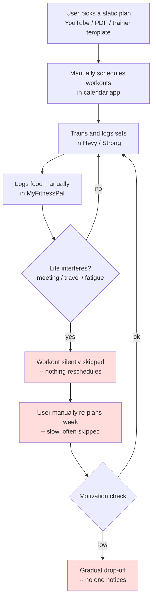
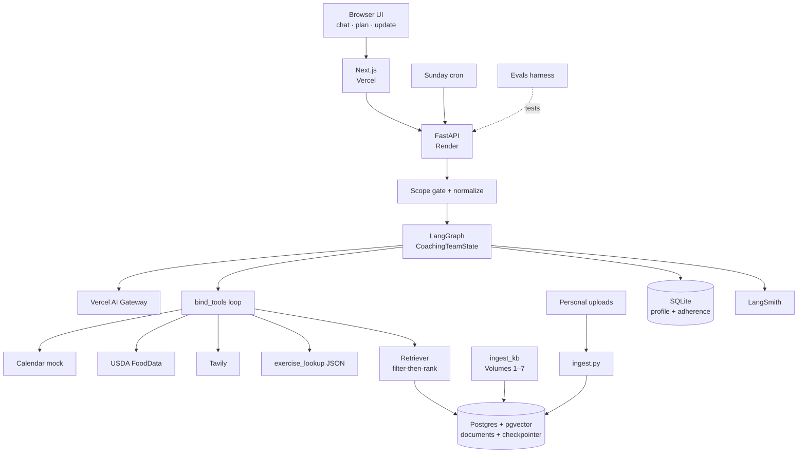
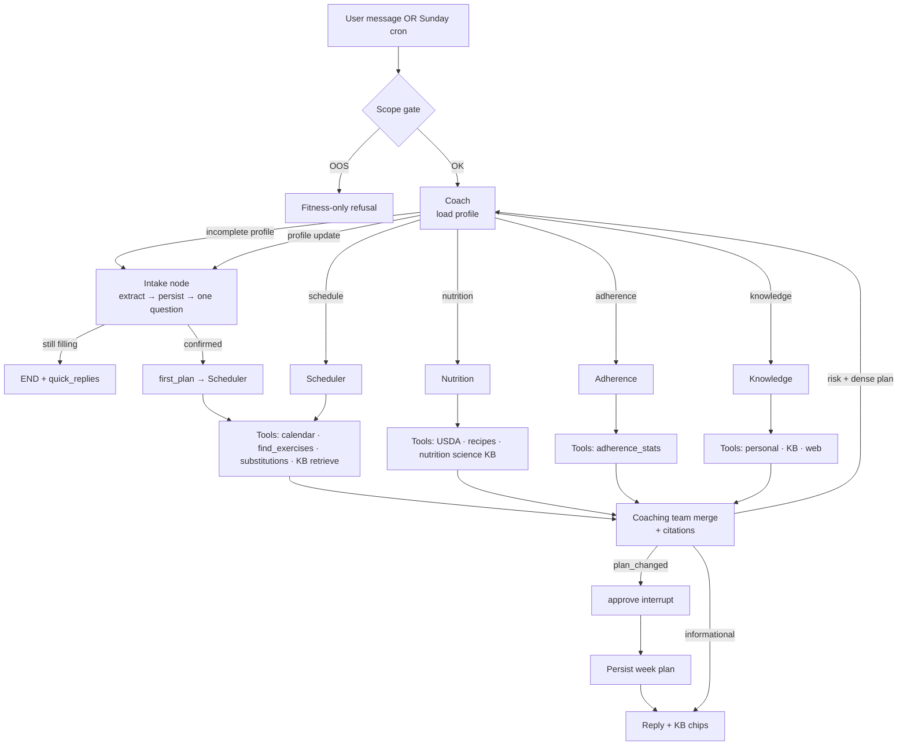

# SteadyFit — Capstone Plan & Architecture

An agentic AI fitness copilot for everyday people, built as a multi-agent LangGraph system
with Agentic RAG over a **curated SteadyFit knowledge base** plus the user's own uploads,
**LLM tool calling**, conversational onboarding, and human-in-the-loop plan approval.

---

## Task 1: Defining Problem, Audience, and Scope

### Problem (one sentence, no solution implied)

Busy working adults who want to get fit consistently fall off their workout and nutrition
plans within weeks because everyday life — meetings, travel, fatigue, and social meals —
keeps breaking plans that never adapt.

### Why this is a problem (who, what, today, why it fails)

The user is a **busy working professional (25–45)** — think a software engineer, analyst, or
manager — who has joined a gym, wants to lose fat or build muscle, and can realistically
train 3–4 times a week. Their "job function" being automated here is the unpaid second job
of **self-coaching**: planning workouts, planning meals, tracking food, and re-planning every
time life interferes.

Today they cobble together a static plan from a YouTube program or a PDF, a workout logger
(Hevy/Strong), a calorie tracker (MyFitnessPal), and a calendar. None of these talk to each
other, and none of them act on their own. When Tuesday's workout is killed by a late meeting,
nothing reschedules it. When they eat out three times in a week, nothing rebalances the
remaining days. When they silently skip two weeks, nothing notices, simplifies the plan, or
checks in. The tools are passive trackers; all of the adaptive decision-making — the part
people are worst at when tired and demotivated — is left to the user. The predictable result
is the industry's well-known drop-off curve: most gym-goers quit within a few months, not
because their plan was wrong, but because nothing helped the plan survive contact with
real life.

### Current-state workflow diagram



Pain points (red): the re-planning step is manual and usually skipped; missed sessions are
invisible; drop-off is only discovered after it has already happened.

### Evaluation questions / input–output pairs (seed set)

| # | Input (user message / event) | Expected output behavior |
|---|---|---|
| 1 | "I missed Monday's leg day and I'm traveling Wed–Fri with only a hotel gym." | Redistributed week; hotel-friendly **kb_id** substitutions via exercise lookup; no guilt language. |
| 2 | "I had biryani and a mango lassi at a work lunch." | Reasonable calorie/macro estimate; remaining-day guidance; no shaming. |
| 3 | "How do I do a proper push-up?" | Grounded in **KB** `Chest.md` with `[KB: …]` citation. |
| 4 | "Is creatine safe to take daily?" | Web and/or KB science; safe framing. |
| 5 | Sunday review trigger (no user input) | Autonomous weekly summary + next-week proposal + approval request. |
| 6 | User has skipped 3 sessions in 10 days | Adherence flags RISK; plan **simplified**. |
| 7 | "How much protein to build muscle?" | NutritionScience KB (~1.6–2.2 g/kg) + citation. |
| 8 | New user with empty profile | Conversational **intake** (goal → sessions → modes → food → optional age/sex/constraints). |

---

## Task 2: Propose a Solution

### Solution (one sentence)

SteadyFit is a proactive multi-agent fitness copilot — LangGraph Coach + specialists with
**agentic tool calling**, a curated metadata-rich **knowledge base**, personal-doc RAG, live
web search, profile intake, and HITL plan approval — that re-plans training and nutrition
around real life.

### Infrastructure diagram



### Component choices (one sentence each)

| Component | Choice | Why |
|---|---|---|
| LLM(s) | Claude Sonnet 4.5 (primary) + GPT-4o-mini (judge / intake extract) via **Vercel AI Gateway** | Tool-calling + cheap structured classification; swap models with env vars. |
| Agent orchestration | **LangGraph** supervisor + specialists + coaching_team loop | Completeness gate → intake; risk renegotiation; HITL `interrupt`. |
| Tools | **Tavily**, **USDA**, **calendar mock**, **exercise_lookup** (structured), **retrieve_*** | Selection via deterministic filters; explanation via semantic KB/personal/web. |
| Embedding | **text-embedding-3-small** | Short exercise/guide chunks. |
| Vector DB | **Postgres + pgvector** with KB metadata columns + GIN indexes | Shared corpus + personal docs separated by `doc_type`. |
| Memory | Postgres checkpointer + **SQLite** profile (onboarding slots, adherence) | Thread state + durable profile across sessions. |
| Monitoring | **LangSmith** | Traces of tool_calls and agent hops. |
| Evaluation | RAGAS + LLM-as-judge; categories: schedule/nutrition/knowledge/safety/adversarial/onboarding/**kb_retrieval** | Known gold chunks for KB cases. |
| UI | **Next.js** — chat chips, KB citation pills, plan approve | Phone + laptop demo surface. |
| Deploy | Render API + Vercel `web/` | Cron weekly review + public UI. |

### Agent workflow diagram (end to end)



**How it works:** Chat enters a **scope gate** (with fitness-hint fast path during intake).
The Coach loads SQLite profile; if onboarding is incomplete it routes to **intake**
(structured extraction, one warm question, optional chips). After confirmation, **first_plan**
runs the Scheduler with KB templates + exercise IDs. Otherwise the Coach classifies intent
and specialists call tools via `bind_tools` / ToolMessage loops. Knowledge is three-way:
personal uploads \| curated KB \| Tavily. The coaching team merges proposals and must keep
`[KB: File — Section]` citations when KB was used. Plan changes hit HITL approve.

---

## Task 3: Dealing with the Data

### Chunking strategy

**Two paths:**

1. **Personal uploads** (`app/rag/ingest.py`): markdown-header then recursive split (~750 tokens /
   3000 chars, overlap) — good for free-form programs/recipes.
2. **Curated KB** (`app/rag/ingest_kb.py`): split on `##` (one exercise/section = one chunk);
   if a section exceeds ~1200 tokens, split on `###`. Parse `` ```yaml `` `` metadata into
   columns (`kb_id`, muscles, equipment, modality, difficulty, contraindications). **No**
   recursive splitter on exercises — atomic units by design.

### Data sources

| Source | Store | Role |
|---|---|---|
| Volumes 1–7 (`data/knowledge_base/`) | pgvector `doc_type=kb_*` | Shared technique, guides, templates, science |
| `exercise_library.json` | In-process index | Structured `find_exercises` / `get_substitutions` (no embeddings) |
| User uploads | pgvector `doc_type=personal` | Private programs/recipes |
| Tavily | Live | Current / public facts |
| USDA | Live | Macro grounding |
| SQLite profile | Key/value | Onboarding slots + adherence logs |

**Rule of thumb:** structured lookup for **selection**; semantic RAG for **explanation**.

---

## Task 4: End-to-End Prototype (built)

1. Graph: Coach → Intake \| Scheduler \| Nutrition \| Adherence \| Knowledge → Coaching team →
   Approve; Postgres checkpointer pool.
2. Agentic tools on specialists (`app/graph/tool_agent.py` + `app/tools/agent_tools.py`).
3. Curated KB ingest + metadata-filtered retrieve; personal path kept separate.
4. Conversational onboarding + `--fresh` seed; UI quick-reply chips + citation chips.
5. Scope gate + rate limit + `<untrusted>` wrappers.
6. Sunday cron weekly review; Next.js on Vercel + API on Render.

---

## Task 5: Evals

- Golden set expanded beyond the original 20: **adversarial**, **onboarding**, **kb_retrieval**
  (ids through ~38) with known gold sources for KB cases.
- Harness: LLM-as-judge (groundedness, plan sanity, tone, safety) + RAGAS for
  `rag_*` / `kb_retrieval` when context is present.
- Run: `uv run python evals/run_evals.py` → `evals/summary.md`.

---

## Task 6: Improving the Prototype

**Shipped instead of / alongside earlier Task-6 sketch:**

| Improvement | Status |
|---|---|
| Metadata-filtered dense retrieval (doc_type / modality) | Done |
| Structured exercise index + substitutions tools | Done |
| KB section-aware ingest + citations in UI | Done |
| Agentic `bind_tools` loops | Done |
| Hybrid BM25 + RRF | Still optional stretch |
| Council critique-and-revise loop | Stretch — coaching_team is still single-pass merge |

Report before/after on `kb_retrieval` + schedule cases after a full eval run.

---

## Task 7: Next Steps

**Keep for Demo Day:** intake → first plan approve; hotel re-plan with kb_ids; KB technique
question with citation chips; LangSmith tool_call traces; eval table.

**Change/improve later:** Google Calendar OAuth; vision meal logging; multi-user Postgres
profiles; streaming UI; BM25 hybrid; council critique pass.

---

## Final submission checklist

- [ ] Public GitHub repo
- [ ] ≤10-min Loom (intake or miss → hotel re-plan → KB push-up cite → Tavily/creatine →
      Sunday review → LangSmith → eval table)
- [ ] This document updated with **actual eval numbers** after `run_evals.py`
- [x] Architecture docs (README + PLAN) aligned with current code
- [x] Code (graph, KB, tools, onboarding, UI)
