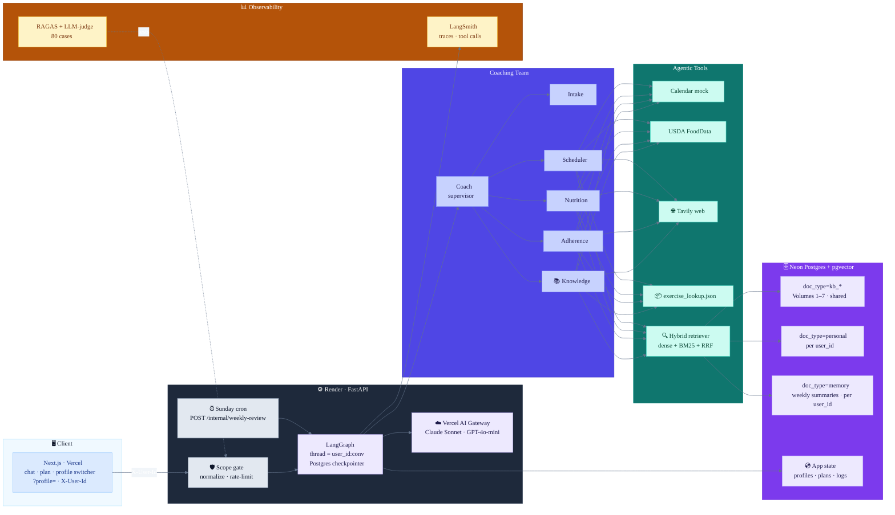
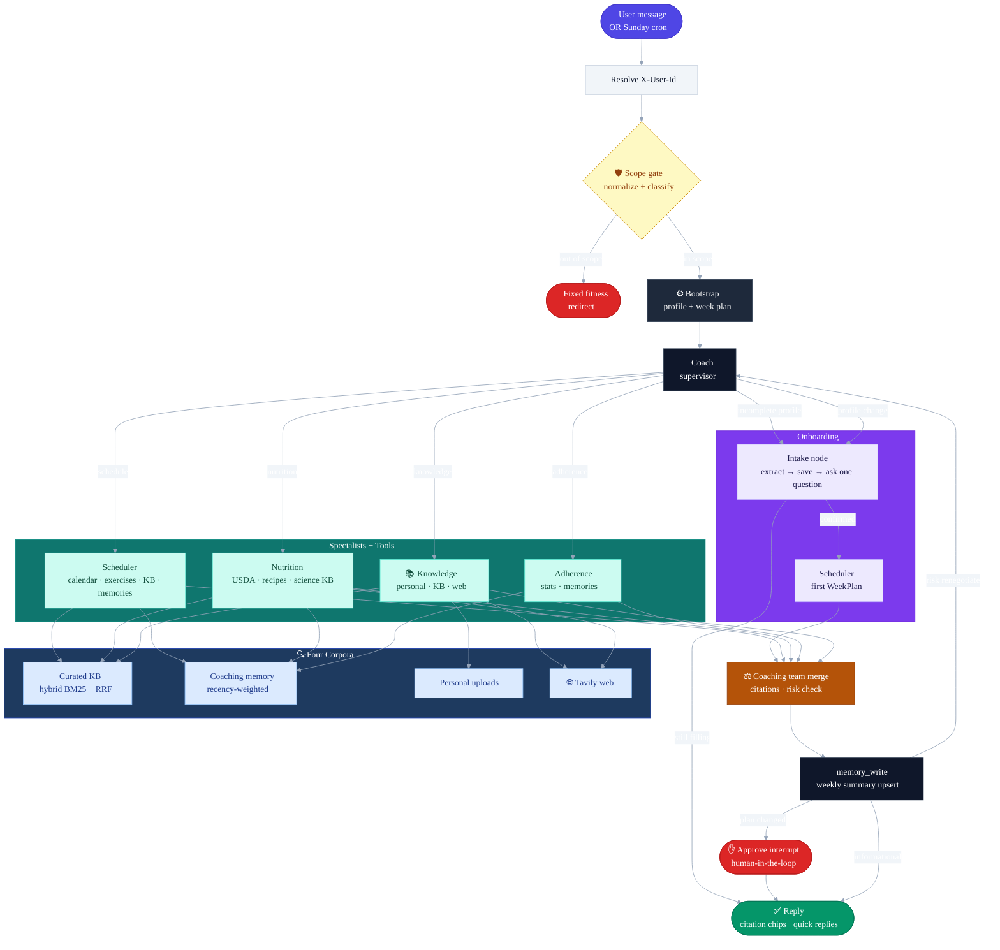

# SteadyFit

An agentic AI fitness copilot for everyday people. A LangGraph **AI Coaching Team** —
Coach (supervisor) + Intake, Scheduler, Nutrition, Adherence, Knowledge — grounded in a
**curated knowledge base** (Volumes 1–7 in pgvector with **hybrid dense + FTS RRF**
retrieval), the user's own uploads, **coaching memory** (past weeks), and live web
search (Tavily). Specialists use **LLM tool calling** (`bind_tools`) for calendar,
USDA, exercise lookup, and RAG. A **context-aware scope gate** (prior-turn + pending
HITL/intake bypass) keeps chat on fitness. Conversational onboarding fills the profile
before coaching; plan changes pause for human approval.

**Multi-profile demo** (no real auth): switch personas with `X-User-Id` /
`?profile=demo-new|demo-veteran`. Profiles, plans, adherence, personal uploads, and
memories are scoped per user in Postgres.

See **PLAN.md** for the full capstone plan (Tasks 1–7).

## Architecture



### Turn flow (mermaid)



## Quick start

### Backend (API)

```bash
uv sync
cp .env.example .env        # fill in API keys and DATABASE_URL
uv run python scripts/init_db.py
uv run python scripts/migrate_documents_kb.py   # KB metadata columns (idempotent)
uv run python scripts/migrate_documents_memory.py  # multi-user memory upsert index
uv run python scripts/migrate_add_fts.py        # content_tsv + GIN for hybrid retrieval
uv run python -m app.rag.ingest_kb data/knowledge_base/   # curated KB → pgvector
uv run python scripts/seed_memory.py --profile fresh    # demo-new (onboarding)
uv run python scripts/seed_memory.py --profile veteran --no-llm   # demo-veteran (history)
# Add --yes if DATABASE_URL is not localhost (e.g. Neon)
uv run uvicorn app.main:app --reload --port 8000
```

Demo profiles switch in the UI (`?profile=demo-new` / `demo-veteran`); every API call sends `X-User-Id`.

### Frontend (Next.js)

```bash
cd web
cp .env.local.example .env.local   # NEXT_PUBLIC_API_URL=http://localhost:8000
npm install
npm run dev
# open http://localhost:3000  (or /chat?profile=demo-veteran)
```

Personal upload (scoped to the active profile):
```bash
# Or rely on seed_memory --profile veteran, which ingests data/eval_uploads/*
curl -H "X-User-Id: demo-veteran" -F "file=@data/eval_uploads/my_program.md" http://localhost:8000/api/upload
```

Tests and evals:
```bash
uv run pytest tests/
uv run python evals/run_evals.py --label hybrid_retrieval   # 80 cases → summary_hybrid_retrieval.*
uv run python evals/compare.py --a baseline_fixed --b hybrid_retrieval
# Categories (13): schedule, nutrition, adherence, knowledge, safety, autonomous,
#   adversarial, onboarding, kb_retrieval, rag_personal, rag_web, memory, gate_context
# RAGAS (faithfulness, answer_relevancy, context_precision/recall, answer_correctness)
# on rag_* / kb_retrieval / memory. Local harness forces LangSmith tracing off.
# Artifacts: evals/summary_baseline_fixed.md, summary_hybrid_retrieval.md,
#   comparison_baseline_fixed_vs_hybrid_retrieval.md
```

**LangSmith (optional):**
```bash
LANGSMITH_TRACING=true
LANGSMITH_API_KEY=your-key
LANGSMITH_PROJECT=steadyfit-dev
# Full experiment: uv run python evals/run_evals.py --experiment
# Chat/API tracing: see TRACING.md
```

## Deploy

**API (Render):** `render.yaml` — web service + Sunday cron. Set secrets from `.env.example`.

**Frontend (Vercel):** Root Directory = `web`, set
`NEXT_PUBLIC_API_URL=https://<your-render-api>.onrender.com`.

CORS: `FRONTEND_URL` on Render to your Vercel origin.

## Repo map

```
app/
  main.py / chat_pipeline.py / security.py   # scope gate, chat/approve/profiles APIs
  graph/          coach, intake, specialists, coaching_team, memory_write, approve, tool_agent
  rag/            ingest.py · ingest_kb.py · memory_store.py · retriever.py (dense + hybrid RRF)
  tools/          calendar, food_api, tavily, exercise_lookup, agent_tools (@tool)
  memory/         Postgres profiles + adherence + weekly_summary + user_context
web/              Next.js — chat (chips + citations), plan, update/upload, profile switcher
data/knowledge_base/   Volume1–7 markdown + exercise_library.json
evals/            golden_dataset.jsonl (80) + harness + compare.py + labeled results
data/eval_uploads/ personal fixtures for rag_personal (seeded onto demo-veteran)
scripts/          init_db, migrate_documents_*, migrate_add_fts, seed_memory, backfill_memories
tests/            routing, HITL, gate_context, hybrid RRF, KB, memory isolation, security
PLAN.md           Capstone Tasks 1–7 (incl. hybrid before/after)
TRACING.md        LangSmith setup
```
