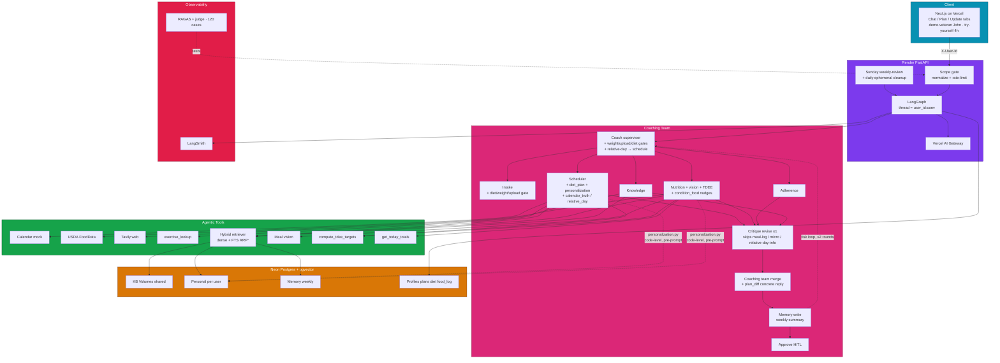
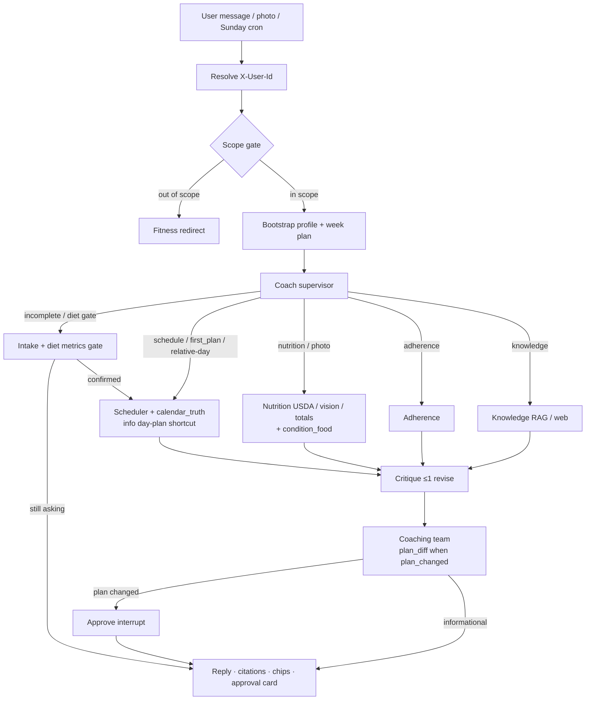

# SteadyFit

An agentic AI fitness copilot for everyday people. A LangGraph **AI Coaching Team** —
Coach (supervisor) + Intake, Scheduler, Nutrition, Adherence, Knowledge — grounded in a
**curated knowledge base** (Volumes 1–7 in pgvector with **hybrid dense + FTS RRF**
retrieval), the user's own uploads, **coaching memory** (past weeks), and live web
search (Tavily). Specialists use **LLM tool calling** (`bind_tools`) for calendar,
USDA, exercise lookup, meal vision, TDEE, and RAG.

**Shipped product surface:** conversational onboarding → diet-metrics gate → first
week of **workouts + KB meal plan** (HITL approve) · **photo meal logging** ·
**try-it-yourself** guest profiles (4h TTL) · **council critique-and-revise** ·
**deterministic relative-day + plan_diff replies** · condition-aware meal nudges ·
context-aware scope gate · `demo-veteran` (John) for the public demo (`demo-new`
is eval-only — use **try-it-yourself** for a new-user walkthrough).

See **deliverables.md** (Tasks 1–7) and **IMPROVEMENTS_LOG.md** (post-baseline changelog
with eval evidence).

## Live demo

| | URL |
|---|---|
| **App (Vercel)** | https://steady-fit.vercel.app |
| **API (Render)** | https://steadyfit-api.onrender.com |
| **Health** | https://steadyfit-api.onrender.com/health → `{"ok":true}` |

Verified working (CORS allows the Vercel origin). GitHub: https://github.com/saurabhIU/SteadyFit

## Architecture

```
Next.js UI (Vercel) ──► FastAPI API (Render)
  ?profile=… / Try it yourself     X-User-Id header
         │                     │
         │            normalize + scope gate
         │                     │
         │            LangGraph (Postgres checkpointer)
         │            thread = {user_id}:{conversation}
         │                     │
         │              coach (completeness + diet gate
         │                     + relative-day → schedule)
         │               ├─ intake ──► diet slots ──► first_plan → scheduler
         │               ├─ scheduler  ┐  calendar_truth + plan JSON
         │               ├─ nutrition  ┼─► critique ─► coaching_team → memory_write
         │               ├─ adherence  │         │         │
         │               └─ knowledge ─┘         │    plan_diff reply (HITL)
         │                                       ├─ approve | coach loop | END
         │
         └── citations / quick_replies / plan+diet approval / photo log

External cron ──► POST /internal/weekly-review
               └── POST /internal/cleanup-expired-profiles  (try-* TTL, 4h)

API: /api/chat · /api/profiles (+/try guest, +/{id}/reset) · /api/approve
     /api/plan · /api/food_log/today · /api/quick-workout/complete · /api/upload

Tools: calendar · USDA · Tavily · exercise_lookup · meal_vision · compute_tdee ·
       get_today_totals · log_food_entry · retrieve_*
Deterministic helpers (not LLM):
  plan_utils.resolve_relative_day / calendar_truth_block  (today/tomorrow)
  plan_diff.compute_plan_diff / format_plan_diff_reply   (plan_changed chat)
  condition_food.build_condition_nudge                   (diabetes/hypertension)
RAG / memory (Postgres + pgvector `documents`):
  personal uploads  ──► doc_type=personal   (user_id; dense)
  curated KB Volumes──► doc_type=kb_*       (shared; hybrid dense+FTS RRF)
  weekly summaries  ──► doc_type=memory     (user_id; dense+recency)
App state: profiles · week_plans · diet_plan_days · food_log · workout_log · weight_log
Gateway: Vercel AI Gateway · Traces: LangSmith
Evals: 120 golden cases · RAGAS + LLM-judge
```


```mermaid
flowchart TD
    subgraph CLIENT[Client]
        UI[Next.js on Vercel<br/>Chat / Plan / Update tabs<br/>demo-veteran John · try-yourself 4h]
    end

    subgraph BACKEND[Render FastAPI]
        GATE[Scope gate<br/>normalize + rate-limit]
        LG[LangGraph<br/>thread = user_id:conv]
        GW[Vercel AI Gateway]
        CRON[Sunday weekly-review<br/>+ daily ephemeral cleanup]
    end

    subgraph AGENTS[Coaching Team]
        COACH[Coach supervisor<br/>+ weight/upload/diet gates<br/>+ relative-day → schedule]
        INT[Intake<br/>+ diet/weight/upload gate]
        SCH[Scheduler<br/>+ diet_plan + personalization<br/>+ calendar_truth / relative_day]
        NUT[Nutrition + vision + TDEE<br/>+ condition_food nudges]
        ADH[Adherence]
        KNOW[Knowledge]
        CRIT[Critique revise ≤1<br/>skips meal-log / micro / relative-day-info]
        TEAM[Coaching team merge<br/>+ plan_diff concrete reply]
        MWRITE[Memory write<br/>weekly summary]
        HITL[Approve HITL]
    end

    subgraph TOOLS[Agentic Tools]
        T1[Calendar mock]
        T2[USDA FoodData]
        T3[Tavily web]
        T4[exercise_lookup]
        T5[Hybrid retriever<br/>dense + FTS RRF*]
        T6[Meal vision]
        T7[compute_tdee_targets]
        T8[get_today_totals]
    end

    subgraph STORAGE[Neon Postgres + pgvector]
        KB[KB Volumes shared]
        PERS[Personal per user]
        MEM[Memory weekly]
        APP[Profiles plans diet food_log]
    end

    subgraph OBS[Observability]
        LS[LangSmith]
        EV[RAGAS + judge · 120 cases]
    end

    UI -->|X-User-Id| GATE
    CRON --> LG
    GATE --> LG
    LG --> GW
    LG --> COACH
    COACH --> INT
    COACH --> SCH
    COACH --> NUT
    COACH --> ADH
    COACH --> KNOW
    SCH --> CRIT
    NUT --> CRIT
    ADH --> CRIT
    KNOW --> CRIT
    CRIT --> TEAM
    TEAM --> MWRITE
    MWRITE --> HITL
    MWRITE -.->|risk loop, ≤2 rounds| COACH
    SCH --> T1
    SCH --> T4
    SCH --> T5
    SCH --> T7
    SCH -.->|personalization.py<br/>code-level, pre-prompt| PERS
    NUT --> T2
    NUT --> T5
    NUT --> T6
    NUT --> T7
    NUT --> T8
    NUT -.->|personalization.py<br/>code-level, pre-prompt| PERS
    KNOW --> T3
    KNOW --> T5
    T5 --> KB
    T5 --> PERS
    T5 --> MEM
    LG --> APP
    LG --> LS
    EV -.->|tests| GATE

    style CLIENT fill:#0891b2,stroke:#164e63,color:#fff
    style BACKEND fill:#7c3aed,stroke:#4c1d95,color:#fff
    style AGENTS fill:#db2777,stroke:#831843,color:#fff
    style TOOLS fill:#16a34a,stroke:#14532d,color:#fff
    style STORAGE fill:#d97706,stroke:#78350f,color:#fff
    style OBS fill:#e11d48,stroke:#881337,color:#fff
```

*Hybrid retriever (`retrieve()` / `retrieve_hybrid()` in `app/rag/retriever.py`) had a
silent SQL parameter-ordering bug — every filtered KB query fell back to
`[kb:error]` — introduced the same day hybrid retrieval shipped and undetected
for 13 days across multiple eval runs. Fixed this week; re-run comparison in
`evals/comparison_baseline_fixed_v2_vs_hybrid_retrieval_v2.md`.

Deterministic calendar + plan replies: `app/graph/plan_utils.py`
(`resolve_relative_day`, `calendar_truth_block`) and `app/graph/plan_diff.py`
(`compute_plan_diff` → concrete `plan_changed` chat). Same Monday/`date.today()`
math as Plan day tiles — never LLM weekday inference.

### Turn flow


```mermaid
flowchart TD
    MSG[User message / photo / Sunday cron]
    HDR[Resolve X-User-Id]
    GATE{Scope gate}
    REFUSE[Fitness redirect]
    BOOT[Bootstrap profile + week plan]
    COACH[Coach supervisor]
    INT[Intake + diet metrics gate]
    SCH[Scheduler + calendar_truth<br/>info day-plan shortcut]
    NUT[Nutrition USDA / vision / totals<br/>+ condition_food]
    ADH[Adherence]
    KNOW[Knowledge RAG / web]
    CRIT[Critique ≤1 revise]
    TEAM[Coaching team<br/>plan_diff when plan_changed]
    HITL[Approve interrupt]
    OUT[Reply · citations · chips · approval card]

    MSG --> HDR --> GATE
    GATE -->|out of scope| REFUSE
    GATE -->|in scope| BOOT --> COACH
    COACH -->|incomplete / diet gate| INT
    INT -->|still asking| OUT
    INT -->|confirmed| SCH
    COACH -->|schedule / first_plan / relative-day| SCH
    COACH -->|nutrition / photo| NUT
    COACH -->|adherence| ADH
    COACH -->|knowledge| KNOW
    SCH --> CRIT
    NUT --> CRIT
    ADH --> CRIT
    KNOW --> CRIT
    CRIT --> TEAM
    TEAM -->|plan changed| HITL --> OUT
    TEAM -->|informational| OUT
```

## What’s in the product (high signal)

| Feature | What it does |
|---|---|
| **Try it yourself** | Guest `try-*` profile (**4h** TTL) — full onboarding without picking a demo persona |
| **demo-veteran (John)** | Public profile switcher; `demo-new` is eval-only (not in the UI) |
| **Diet gate + TDEE** | Weight → target → height → activity before first plan; Mifflin–St Jeor in code |
| **Diet week** | KB Indian meal templates → `diet_plan_days`; HITL shows workouts + meals + macros |
| **Photo meal log** | Vision ID → USDA → `food_log`; Plan page splits **planned** vs **logged** |
| **Condition-aware food nudges** | Diabetes / hypertension flags on meal log (`condition_food.py`); meal-log-only path |
| **Relative-day calendar** | `today` / `tomorrow` resolved in code (`plan_utils`); info queries skip LLM weekday guess |
| **Diff-based plan replies** | `plan_changed` chat names day + duration + `[Memory:…]` (`plan_diff.py`); card still holds full week |
| **Council critique** | Pre-merge quality check (knee / preference / volume); one revise cycle max |
| **Hybrid RAG** | Dense + FTS RRF over Volumes 1–7; personal docs + coaching memory separate |
| **HITL approve** | Plan changes pause until Accept / Not yet |

## Quick start

### Backend (API)

```bash
uv sync
cp .env.example .env        # AI_GATEWAY_API_KEY, DATABASE_URL, OPENAI_API_KEY, …
uv run python scripts/init_db.py
uv run python scripts/migrate_documents_kb.py
uv run python scripts/migrate_documents_memory.py
uv run python scripts/migrate_add_fts.py
uv run python -m app.rag.ingest_kb data/knowledge_base/
uv run python scripts/seed_memory.py --profile fresh     # demo-new: internal eval fixture only, not in the UI
uv run python scripts/seed_memory.py --profile veteran --no-llm
uv run uvicorn app.main:app --reload --port 8000
```

### Frontend (Next.js)

```bash
cd web
cp .env.local.example .env.local   # NEXT_PUBLIC_API_URL=http://localhost:8000
npm install
npm run dev
# http://localhost:3000  ·  /chat?profile=demo-veteran  ·  Try it yourself
```

### Tests and evals

```bash
uv run pytest tests/
uv run python evals/run_evals.py --label try_profile_ux_full   # large suite
# Golden set: 120 cases · categories include schedule, nutrition, photo_meal,
#   council_critique, diet_plan, weight_gate, try_profile_ux, calendar_day,
#   kb_retrieval, …
# Task 5/6 labeled pair still available:
uv run python evals/run_evals.py --compare baseline_fixed hybrid_retrieval
```

**LangSmith (optional):** see `TRACING.md`.

## Deploy

| Service | Host | Notes |
|---|---|---|
| API | **Render** (`render.yaml` → `steadyfit-api`) | https://steadyfit-api.onrender.com |
| Web | **Vercel** (Root Directory = `web`) | https://steady-fit.vercel.app |
| Cron | Render | Sunday weekly-review + daily try-profile cleanup |

Set `NEXT_PUBLIC_API_URL=https://steadyfit-api.onrender.com` on Vercel and
`FRONTEND_URL=https://steady-fit.vercel.app` on Render (CORS).

## Repo map

```
app/
  main.py / chat_pipeline.py / security.py
  graph/     coach, intake, diet_gate, tdee, diet_plan, weight_gate,
             plan_utils, plan_diff, condition_food, personalization,
             specialists, critique, coaching_team, approve, tool_agent
  rag/       ingest · ingest_kb · memory_store · retriever (hybrid RRF)
  tools/     calendar, food_api, tavily, exercise_lookup, meal_vision, agent_tools
  memory/    Postgres profiles · week_plans · diet_plan_days · food_log
web/         chat (photo + chips + approval) · plan (planned vs logged) · upload
evals/       golden_dataset.jsonl (120) · harness · labeled summaries
IMPROVEMENTS_LOG.md   Post-baseline changelog + eval pointers
deliverables.md       Capstone Tasks 1–7
```
